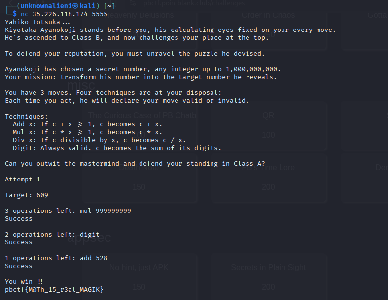

# Classroom of the Elite  
**Category:** Misc  

## Solution

1. By analysing the rules, we can figure our "digit" is a powerful tool, but how to make it more powerful? 
2. We know the divisibility rule of 9, any of its multiple's digit sum is a multiple of 9.
3. Extending this to 999999999, for the given range, after multiplying by 999999999 and applying digit, it always lands to 81
4. Then you know...